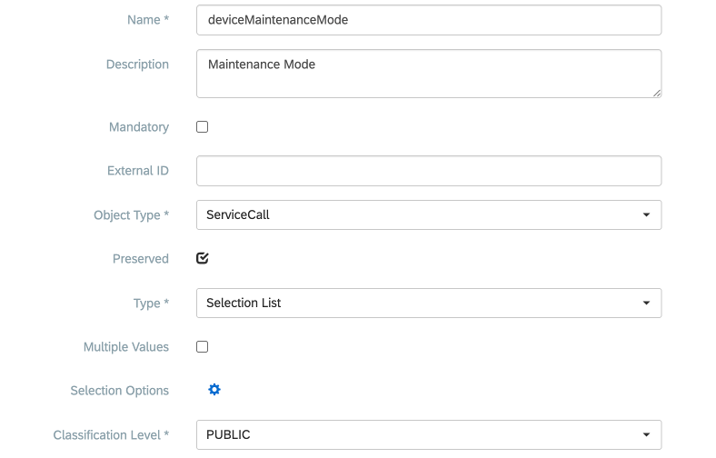
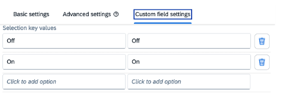
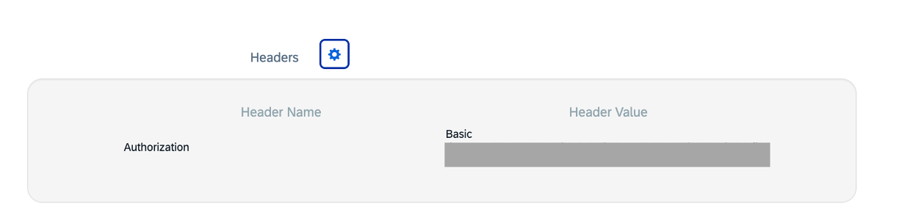
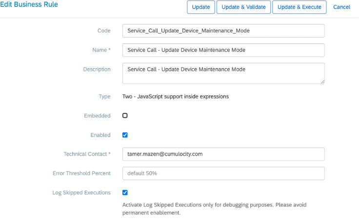
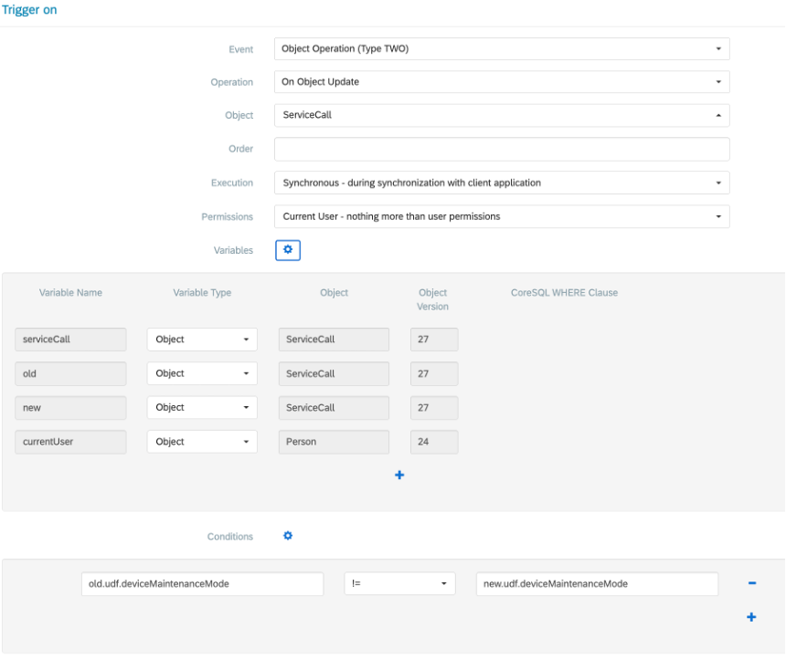
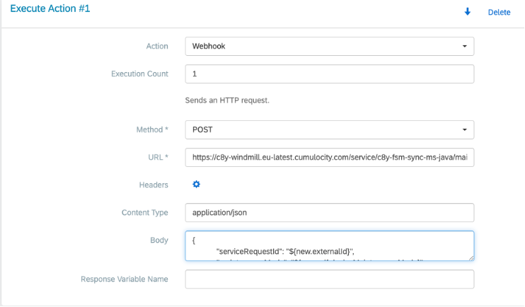

# How to Use SAP FSM Business Rules to Call Cumulocity

This guide outlines how to enable or disable maintenance mode in Cumulocity for a device associated with an SAP FSM Service Call using FSM Business Rules.

---

## 1. Add Custom Field

1. From the Admin portal, select your company.
2. In the left navigation menu, select **Custom Objects** -> **Custom Field Definitions**.
3. Click **Create** to create a new Custom Field.
4. Configure the properties as follows:
   * **Name:** `deviceMaintenanceMode`
   * **Description:** `Maintenance Mode`
   * **Object Type:** `ServiceCall`
   * **Type:** `Selection List`
   * **Classification Level:** `PUBLIC`



5. Click **Save**.

---

## 2. Add Custom Field to Service Call Screen

1. From the Admin portal, select your company.
2. In the left menu, select **Screen Configurations**.
3. Select **ServiceCallAppServiceCallTab** (*Service Call App - Service Call Detail Tab*).
4. Click the edit icon ().
5. Locate the list of custom fields on the right side panel.
6. Drag and drop the **Maintenance Mode** custom field into the `details_group`.
7. Click the three dots next to the custom field and select **Settings**.
8. In the **Basic settings** tab, verify that the custom field is configured to be editable and visible.
9. Open the **Custom field settings** tab and configure the selection key values as follows:
   * `Off` : `Off`
   * `On` : `On`





10. **Activate** the screen configuration.

---

## 3. Microservice Endpoint Setup

Build and deploy the [Cumulocity FSM Sync Microservice](../fsm-syn-microservice/) to handle the incoming maintenance mode webhook updates if it is not already deployed:

* **Target Endpoint:** `maintenanceMode/updateMaintenanceMode`
* **Service Name:** `c8y-fsm-sync-ms-java`

---

## 4. Add FSM Business Rule

1. From the Admin portal, select your company.
2. In the left menu, select **Business Rules**.
3. Click **Create**.
4. Enter the rule details:
   * **Code:** `Service_Call_Update_Device_Maintenance_Mode`
   * **Name:** `Service Call - Update Device Maintenance Mode`
   * **Description:** `Service Call - Update Device Maintenance Mode`
   * **Type:** `Two - JavaScript support inside expressions`



5. Configure the **Trigger on** section:
   * **Event:** `Object Operation (Type TWO)`
   * **Operation:** `On Object Update`
   * **Object:** `ServiceCall`
   * **Execution:** `Synchronous - during synchronization with client application`
   * **Permissions:** `Current User - nothing more than user permissions`
   * **Conditions:** `old.udf.deviceMaintenanceMode != new.udf.deviceMaintenanceMode`



6. Configure **Execute Action #1**:
   * **Action:** `Webhook`
   * **Execution Count:** `1`
   * **Method:** `POST`
   * **URL:** `https://<your-tenant>.cumulocity.com/service/c8y-fsm-sync-ms-java/maintenanceMode/updateMaintenanceMode`
   * **Header:** `Authorization` : `Basic <base64-credentials>`
   * **Content Type:** `application/json`
   * **Body:**
     ```json
     {
       "serviceRequestId": "${new.externalId}",
       "maintenanceMode": "${new.udf.deviceMaintenanceMode}"
     }
     ```



7. Click **Update & Validate**.

---

## 5. Testing the Integration

1. Click **Update & Execute**.
2. Pass any Service Call ID that possesses a valid Cumulocity Service Request mapped as its `externalId`.
